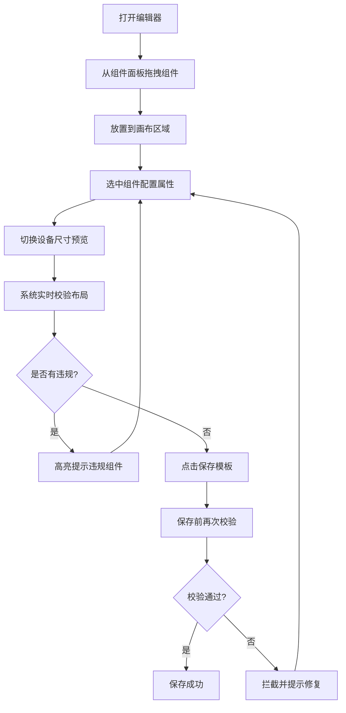

## 1. 产品概述

前端页面模板可视化编辑器，通过拖拽式组件布局和实时预览，帮助开发人员快速搭建页面模板，减少重复开发工作。支持 PC 和移动端两套画布尺寸，提供组件层级嵌套冲突校验和移动端适配溢出检测，确保模板质量。

## 2. 核心功能

### 2.1 用户角色

| 角色 | 注册方式 | 核心权限 |
|------|----------|----------|
| 开发人员 | 无需注册，本地使用 | 拖拽组件、编辑属性、保存模板、校验布局 |

### 2.2 功能模块

1. **编辑器主页面**：组件面板、画布区域、属性面板、设备切换工具栏
2. **组件库**：表单组件、表格组件、弹窗组件、布局容器、基础元素
3. **布局校验**：层级嵌套冲突检测、移动端溢出检测、保存前拦截
4. **主题配置**：自定义组件默认参数、样式主题切换
5. **模板管理**：保存模板、加载模板、模板列表

### 2.3 页面详情

| 页面名称 | 模块名称 | 功能描述 |
|----------|----------|----------|
| 编辑器主页 | 左侧组件面板 | 展示可拖拽的业务组件分类列表，支持搜索过滤 |
| 编辑器主页 | 中间画布区域 | 可视化编辑画布，支持组件拖拽放置、选中、移动、删除 |
| 编辑器主页 | 右侧属性面板 | 选中组件后展示属性配置表单，可修改组件参数和样式 |
| 编辑器主页 | 顶部工具栏 | 设备尺寸切换（PC/移动端）、主题切换、保存按钮、撤销/重做 |
| 编辑器主页 | 校验提示层 | 实时显示布局校验错误，高亮违规组件 |

## 3. 核心流程

开发人员从左侧组件面板拖拽组件到画布区域，选中组件后在右侧属性面板配置参数，通过顶部工具栏切换设备尺寸查看适配效果。系统实时校验组件层级嵌套和移动端适配问题，保存模板前拦截违规布局并提示修复。

## 4. 用户界面设计

### 4.1 设计风格

- 主色调：深蓝紫渐变 (#6366f1 → #8b5cf6)，专业感与科技感
- 辅助色：青绿色 (#10b981) 用于成功/通过状态，橙红色 (#f59e0b) 用于警告/违规状态
- 按钮风格：圆角 8px，悬停有轻微上浮效果和阴影变化
- 字体：系统无衬线字体，标题 16px 加粗，正文 14px 常规，辅助文字 12px
- 布局风格：三栏布局，左右面板固定宽度，中间画布自适应
- 图标风格：线性简洁图标，与文字对齐

### 4.2 页面设计概述

| 页面名称 | 模块名称 | UI 元素 |
|----------|----------|---------|
| 编辑器主页 | 左侧组件面板 | 分类标签、组件卡片网格、搜索框、悬停高亮 |
| 编辑器主页 | 中间画布区域 | 设备外框阴影、网格背景、组件选中态、拖拽占位符 |
| 编辑器主页 | 右侧属性面板 | 分组折叠面板、表单控件、颜色选择器、数值输入 |
| 编辑器主页 | 顶部工具栏 | 设备切换按钮组、主题下拉、保存按钮、状态指示器 |
| 编辑器主页 | 校验提示层 | 错误列表抽屉、违规组件红色边框、提示气泡 |

### 4.3 响应式

桌面端优先设计，编辑器本身为桌面工具。画布区域支持 PC (1200px) 和移动端 (375px) 两种尺寸模拟，组件布局在不同尺寸下自动适配。

### 4.4 交互动效

- 组件拖拽时：半透明预览跟随鼠标，目标位置显示占位框
- 选中组件：蓝色边框高亮，四角显示缩放控制点
- 校验违规：组件边框闪烁红色提示，右侧滑出错误列表
- 设备切换：画布平滑过渡动画，尺寸渐变
- 面板折叠：平滑的宽度过渡动画
