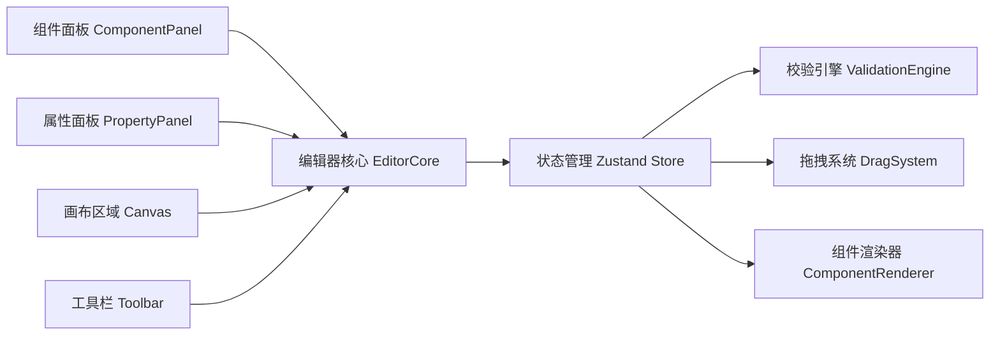

## 1. 架构设计



## 2. 技术描述

- 前端：React@18 + TypeScript + Vite@5
- 样式：TailwindCSS@3 + CSS Variables 主题系统
- 状态管理：Zustand
- 图标：lucide-react
- 拖拽：自定义 HTML5 Drag & Drop 封装
- 校验：自定义规则引擎
- 初始化工具：vite-init

## 3. 目录结构

```
src/
├── components/
│   ├── editor/
│   │   ├── Canvas.tsx          # 画布组件
│   │   ├── ComponentPanel.tsx  # 左侧组件面板
│   │   ├── PropertyPanel.tsx   # 右侧属性面板
│   │   ├── Toolbar.tsx         # 顶部工具栏
│   │   └── ValidationHint.tsx  # 校验提示
│   ├── basic/
│   │   ├── Button.tsx
│   │   ├── Input.tsx
│   │   ├── Select.tsx
│   │   └── ...
│   ├── form/
│   │   ├── FormItem.tsx
│   │   └── FormContainer.tsx
│   ├── display/
│   │   ├── Table.tsx
│   │   └── Card.tsx
│   ├── feedback/
│   │   └── Modal.tsx
│   └── layout/
│       ├── Container.tsx
│       ├── Row.tsx
│       └── Col.tsx
├── store/
│   └── editorStore.ts          # Zustand 状态管理
├── hooks/
│   ├── useDragDrop.ts          # 拖拽 hook
│   └── useValidation.ts        # 校验 hook
├── types/
│   └── index.ts                # 类型定义
├── utils/
│   ├── validationRules.ts      # 校验规则
│   ├── componentRegistry.ts    # 组件注册
│   └── theme.ts                # 主题工具
├── pages/
│   └── Editor.tsx              # 编辑器主页面
├── App.tsx
├── main.tsx
└── index.css
```

## 4. 核心数据模型

### 4.1 组件节点类型

```typescript
interface ComponentNode {
  id: string;
  type: string;
  props: Record<string, any>;
  children: ComponentNode[];
  styles: Record<string, string>;
}
```

### 4.2 编辑器状态

```typescript
interface EditorState {
  components: ComponentNode[];
  selectedId: string | null;
  device: 'pc' | 'mobile';
  theme: string;
  history: ComponentNode[][];
  historyIndex: number;
  validationErrors: ValidationError[];
}
```

### 4.3 校验错误类型

```typescript
interface ValidationError {
  id: string;
  componentId: string;
  type: 'nesting' | 'overflow' | 'rule';
  message: string;
  severity: 'error' | 'warning';
}
```

## 5. 路由定义

| 路由 | 用途 |
|------|------|
| / | 编辑器主页面 |
| /templates | 模板列表页面 |

## 6. 校验规则引擎

### 6.1 层级嵌套规则
- 容器类组件可嵌套子组件
- 表单组件需放置在 Form 容器内
- 表格列不能直接嵌套其他表格
- 弹窗组件内可放置任意内容

### 6.2 移动端适配规则
- 组件宽度超过 375px 触发溢出警告
- 多列布局在移动端需自动堆叠
- 字体大小在移动端需适配
- 按钮点击区域不小于 44x44px

### 6.3 保存拦截
- 存在 error 级别错误时禁止保存
- 存在 warning 级别错误时提示确认
- 显示错误列表并可快速定位

## 7. 主题系统

- CSS Variables 实现主题切换
- 支持主色、辅助色、背景色、文字色自定义
- 组件默认参数可配置
- 预设多套主题模板
